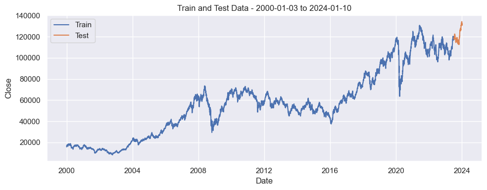
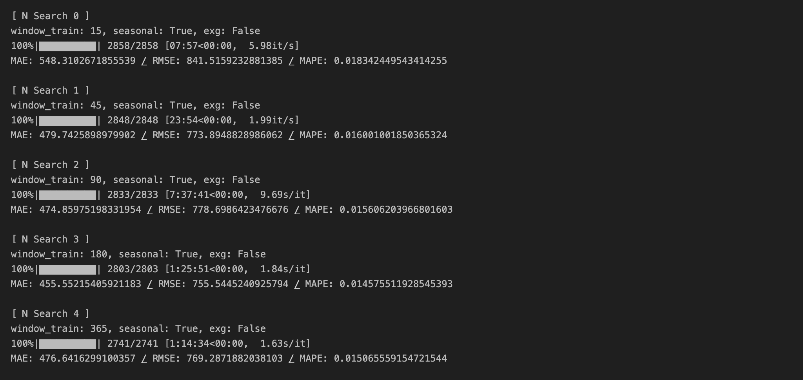
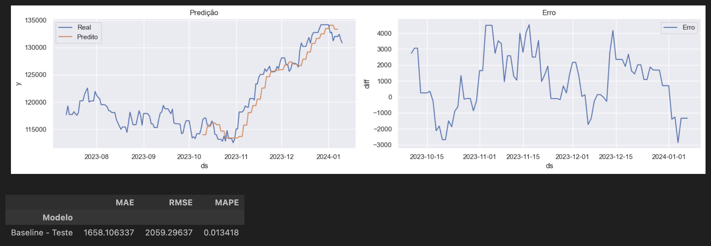
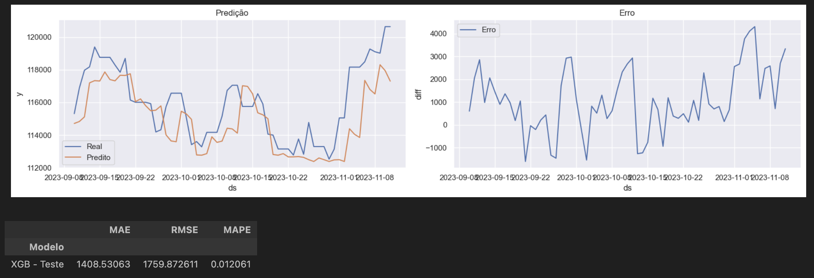
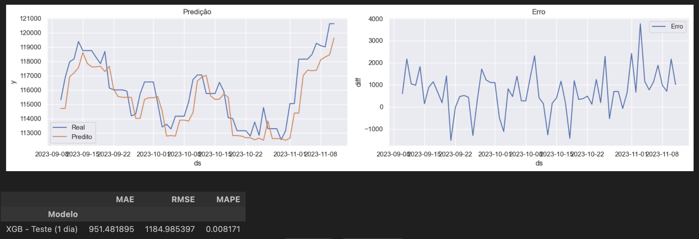
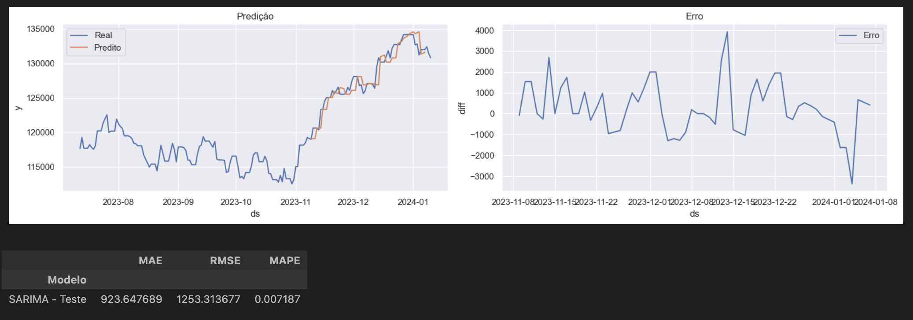

# Projeto de Previsão da IBOVESPA - POSTECH FIAP

Este projeto faz parte do módulo de Data Analytics da pós-graduação da POSTECH FIAP, visando desenvolver um modelo preditivo para o fechamento diário do índice IBOVESPA.

O problema fornecido foi: Imagine que você foi escalado para um time de investimentos e precisará realizar um **modelo preditivo** com dados da **IBOVESPA** (Bolsa de valores) para criar uma série temporal e prever diariamente o fechamento da base.

Dado a característica estocástica do mercado financeiro, a previsão de fechamento da IBOVESPA é um problema _complexo e de difícil solução_, por isso o objetivo será criar um modelo de previsão de fechamento da IBOVESPA apenas para os 3 dias seguintes. A previsão será feita com base nos dados históricos de fechamento.

Como meta, o modelo deve ter um **erro médio percentual absoluto (MAPE) menor que 2%** para os próximos 3 dias.

> O Dashboard pode ser acessado em http://postech.zfab.me/tc-f2

## Metodologia

Os dados serão coletados via API do Yahoo Finance utilizando o pacote `yfinance`. Os dados serão coletados e atualizados em um Banco de Dados Local (SQLite) todos os dias as 06:00.

Em alguns casos a API do Yahoo Finance não retorna os dados do dia anterior, por isso, caso isso ocorra, podemos ter uma defasaem de 1 dia nos dados.

### Treino, Teste e Validação

Para o treino e teste do modelo dividimos o periodo histórico em 183 dias (6 meses) mais recentes para teste o restante para treino.

Para a validação do modelo utilizamos o método de Cross Validation específico para séries temporais, garantindo uma avaliação mais precisa e robusta.

Testamos algumas "janelas" de treinamento para previsão. Como podemos ver na imagem abaixo, no caso do SARIMA, a janela de 180 dias apresentou o melhor resultado na validação cruzada com os dados de treino.

Com isso definimos que o modelo será treinado com os últimos 180 dias de dados para prever os próximos 3 dias.

## Modelos Testados

Para a resolução do problema foram testados 3 modelos e comparados com o resultado de um modelo de Baseline (Naive):

- ARIMA
- SARIMA / SARIMAX
- XGBoost

Como baseline foi escolhido o modelo Naive que utiliza uma média móvel de 7 dias para prever os próximos 3 dias.

### XGBoost

O XGBoost, por não ser um modelo específico para séries temporais, foi necessário alguns pré processamentos nos dados para que o modelo pudesse ser treinado.

Foram criadas variáveis com base na data e nos valores de fechamento defasados. Além disso para cada dia de previsão (dos 3 dias) foi criado um modelo específico.

### Métrica e Validação

Além disso utilizamos o erro médio percentual absoluto (MAPE) como métrica de avaliação dos modelos.

Na validação usamos a técnica de Janela Deslizantes (Sliding Window) no caso dos modelos de Série Temporal (ARIMA e SARIMA). No caso do XGBoost utilizamos o método de Janela Expansora (Expanding Window).

Essa metodologia é crucial para testar a eficácia do modelo em diferentes períodos de tempo e garantir os melhores parâmetros e modelos.

## Resultados

A Baseline (Naive) apresentou no conjunto de Teste um MAPE de 1.34% para a previsão de 3 dias. Esse número que foi utilizado como referência para avaliar os modelos.

O XGBoost conseguiu um MAPE de 1.21% para a previsão de 3 dias. O modelo apresentou um resultado melhor que o baseline.

Quando testamos apenas para a previsão de 1 dia o modelo apresentou um MAPE de 0.82%.

O melhor modelo, que é o usado para a previsão final, foi o SARIMA. O modelo apresentou um MAPE de 0.72% para a previsão de 3 dias.

## Conclusão

O modelo SARIMA treinando com os 180 dias anteriores foi o escolhido. Esse modelo demonstrou um bom resultado (tanto na validação quanto no teste) e por isso criamos o Dashboard e o sistema de predição automática com ele.

### Dashboard

O Dashboard foi criado utilizando o Streamlit e pode ser acessado no link abaixo:

http://postech.zfab.me/tc-f2

Existe uma rotina que atualiza diariamente os dados e, quando necessário, realiza a previsão para os próximos 3 dias.
